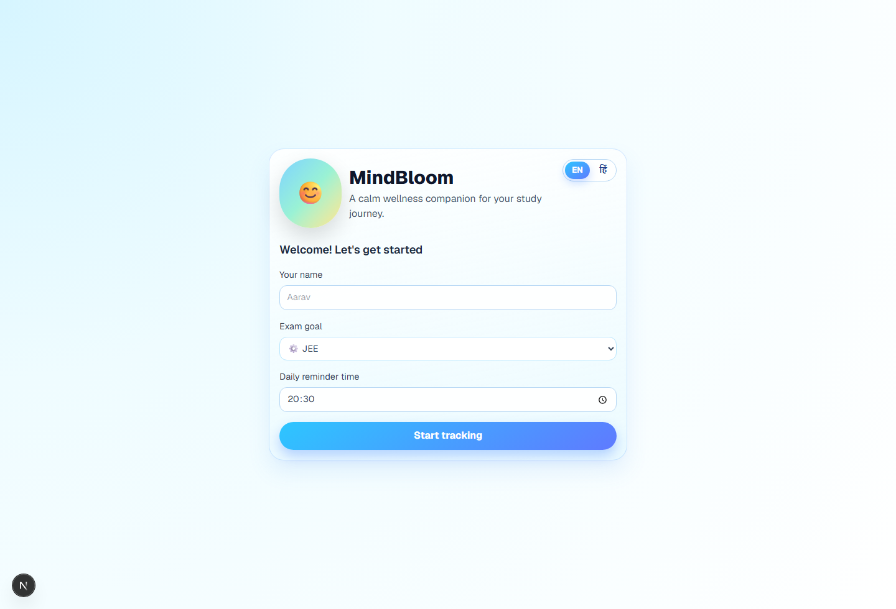
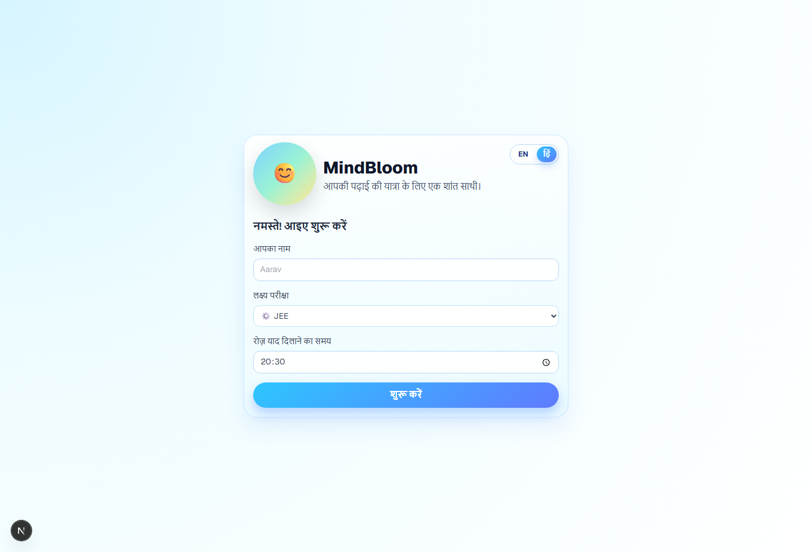
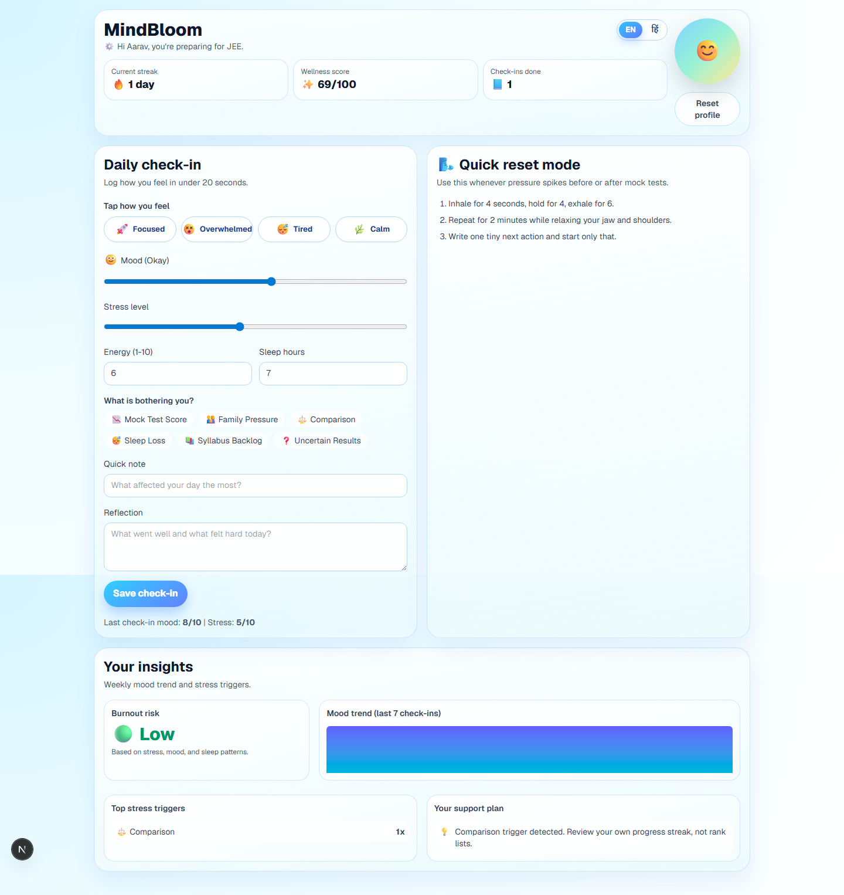
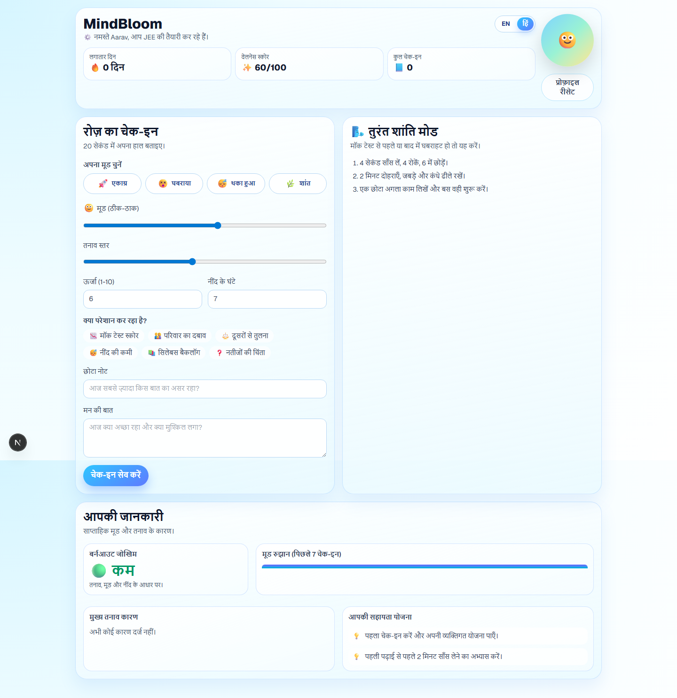
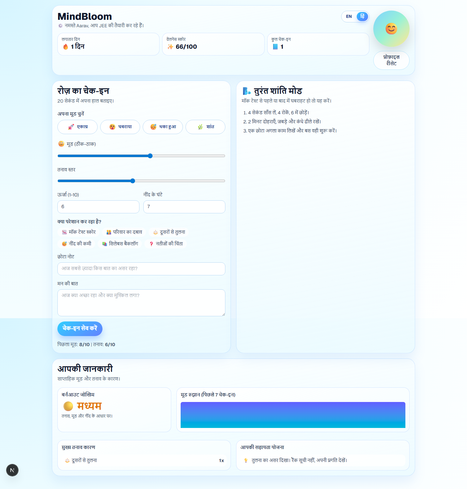

# MannSathi — Mental Wellness Tracker

**MannSathi** (मन साथी — _"a companion for your mind"_) is a student wellness companion built for high-pressure academic journeys. It helps learners notice emotional patterns, catch stress triggers early, and take small, practical recovery actions — long before stress quietly escalates into burnout.

It is **bilingual (English + हिंदी)**, **emoji-first**, **private by design** (data stays on the student's own device), and designed to be finished in under 20 seconds a day.

<p align="center">
  
  
</p>

---

## ✨ Highlights

- 🧠 **20-second daily check-in** — mood, stress, energy, sleep, triggers, and a short reflection.
- 👆 **One-tap mood presets** — 🚀 Focused, 😵 Overwhelmed, 😴 Tired, 🌿 Calm — for days when typing feels like too much.
- 🌏 **Fully bilingual (English + हिंदी)** — every label, prompt, trigger, suggestion, and risk level is translated, with a one-tap toggle that is remembered.
- 🎨 **Emoji-first, Pixar-style UI** — soft, friendly, mobile-first visuals so the app stays approachable for everyone.
- 📊 **Insight dashboard** — recent mood trend, dominant stress triggers, and a color-coded burnout-risk signal (🟢/🟡/🔴).
- 💛 **Warm, personalized support plan** — friendly, human suggestions that respond to how the student actually feels today (details below).
- 🔥 **Gamified motivation** — streaks, a wellness score, and a check-in count make showing up every day feel rewarding.
- 🧘 **Quick reset mode** — a guided breathing routine for high-pressure moments.
- 🔒 **Private by design** — everything is stored locally in the browser; no account, no tracking, no data leaves the device.

---

## 🌏 Built for diverse students (English + हिंदी)

Students come from very different backgrounds, and **language should never be a barrier to mental wellness**. MannSathi is fully **bilingual** and **emoji-first**, so it stays approachable whether or not a student is comfortable with English.

- **One-tap language switch** between **English** and **हिंदी** — the entire interface, including every support suggestion, is translated.
- **Emoji-first, visual design** — moods, stress triggers, goals, and risk levels all use clear pictures so the app is usable even with low reading confidence.
- **Plain, friendly wording** in both languages instead of clinical jargon.
- **Inclusive by default** — the chosen language is remembered across visits.

| English | हिंदी |
| --- | --- |
|  |  |

---

## What the app does

1. **One-tap emotional check-in (under 20 seconds)**
   Tap a mood preset or fine-tune mood, stress, energy, sleep hours, triggers, and a short reflection.
2. **Visual trigger detection**
   Capture recurring stress factors with clear icons — 📉 mock test score, 👨‍👩‍👧 family pressure, ⚖️ comparison, 😴 sleep loss, 📚 syllabus backlog, ❓ uncertain results.
3. **Insight dashboard**
   See a recent mood trend, the most frequent triggers, and a color-coded burnout-risk level derived from the last 7 check-ins.
4. **Personalized support plan**
   Get warm, relatable suggestions tailored to the current check-in and recent trend — in the student's chosen language.
5. **Gamified motivation**
   🔥 streaks, ✨ wellness score, and 📘 check-in count keep daily use rewarding.
6. **Quick reset mode**
   A guided short breathing routine for high-pressure moments.

---

## 💛 How the support suggestions work

The support plan is **transparent and rule-based** — there is no opaque model deciding how a student "should" feel. Each suggestion is written to sound like a supportive friend rather than a clinician, and is available in both English and Hindi.

Suggestions are prioritized so the most important message always appears first:

| Priority | When it triggers | What the student sees |
| --- | --- | --- |
| 🆘 **SOS** | Stress ≥ 8 | A gentle nudge to pause, breathe, and reach out to someone they trust |
| 🌬️ **Breathe** | High burnout risk | Step away for 5 minutes and let the tension drop |
| 🎯 **Narrow scope** | High burnout risk | Pick one small topic and count finishing it as a win |
| 💛 **Be gentle** | Mood ≤ 3 | A reminder that they're a person first, an aspirant second |
| 😴 **Sleep first** | Sleep < 6 hrs or "sleep loss" trigger | Protect 7 hours tonight — the brain learns while sleeping |
| 🔋 **Recharge** | Energy ≤ 3 | Water, a snack, and a 10-minute walk before studying again |
| 🌱 **Comparison** | Comparison trigger | Someone else's rank isn't your story |
| 🧩 **Backlog** | Syllabus backlog trigger | Break the pile into 3 tasks: urgent, important, quick win |
| 📈 **Mock score** | Mock test score trigger | A low mock is feedback, not a final result |
| 🫂 **Family pressure** | Family pressure trigger | Share one honest feeling with them today |
| 🧭 **Uncertainty** | Uncertain results trigger | Control today's effort, not the outcome |
| 🎉 **Celebrate** | Mood ≥ 8 and stress ≤ 4 | Lock in the momentum and enjoy a small reward |
| ✅ **Steady** | Balanced day | Keep the rhythm and take a break every 50 minutes |

A brand-new student (no check-in yet) is welcomed with a friendly nudge to do their first check-in and try a 2-minute breathing reset. The plan shows up to 5 suggestions, de-duplicated and ordered by priority.

The **burnout-risk level** that drives several of these is computed from the last 7 check-ins:

- 🔴 **High** — 3+ days of stress ≥ 8, or sustained high stress with low mood, or average sleep below ~5.5 hrs
- 🟡 **Moderate** — elevated average stress, persistently low mood, or low average sleep
- 🟢 **Low** — a balanced recent pattern

---

## 🔒 Privacy

MannSathi is **local-first**. All profile and check-in data lives in the browser's `localStorage` on the student's own device. There is no sign-up, no server-side storage, and nothing is sent to a third party. Clearing browser storage erases everything.

---

## Product Screens

### Onboarding (bilingual)


### Check-in + insights (Hindi)


---

## Tech Stack

- **Framework:** Next.js 16, React 19, TypeScript
- **Styling & Motion:** Tailwind CSS 4, Framer Motion
- **State:** hydration-safe store via `useSyncExternalStore` (`src/lib/useWellnessStore.ts`)
- **Internationalization:** lightweight EN/HI dictionary (`src/lib/i18n.ts`)
- **Persistence:** browser `localStorage` (`src/lib/storage.ts`)
- **Testing:** Vitest, Testing Library, Playwright
- **CI:** GitHub Actions

## Project structure

```
src/
  app/
    page.tsx                 # Main page: onboarding <-> dashboard, gamification, language toggle
    layout.tsx               # App shell + metadata
  components/
    MoodCheckInForm.tsx      # One-tap presets + detailed check-in
    WellnessDashboard.tsx    # Risk, mood trend, top triggers, support plan
    CharacterBuddy.tsx       # Animated companion
  lib/
    wellness.ts              # Core types + risk engine + support-suggestion catalog
    i18n.ts                  # EN/HI translations
    storage.ts               # Local persistence
    useWellnessStore.ts      # Hydration-safe shared state
```

## Accessibility & inclusivity notes

- Decorative emoji use `aria-hidden`, so screen readers announce clean labels.
- Trigger and preset controls expose proper `aria-pressed` state.
- High-contrast, rounded, mobile-first layout that scales down to small phones.
- Every user-facing string is translated, so the experience is complete in either language.

## Run locally

```bash
npm install
npm run dev
```

Open: `http://localhost:3000`

## Quality checks

```bash
npm run lint        # ESLint
npm run test:run    # Vitest unit + component + integration tests (with coverage)
npm run build       # Production build + type-check
npx playwright install chromium
npm run test:e2e    # Playwright end-to-end tests
```

## CI pipeline

`.github/workflows/ci.yml` runs:

- **build-and-test:** install, lint, unit/component/integration tests, production build
- **e2e:** install, Playwright Chromium setup, browser end-to-end tests

## Roadmap

- More Indian languages (Tamil, Telugu, Bengali, Marathi) building on the same i18n layer
- Optional, opt-in cloud sync and authentication (while keeping local-first as the default)
- Adaptive recommendations that learn from a student's longer-term trend history
- Optional counselor/guardian escalation workflow for sustained severe-stress signals
